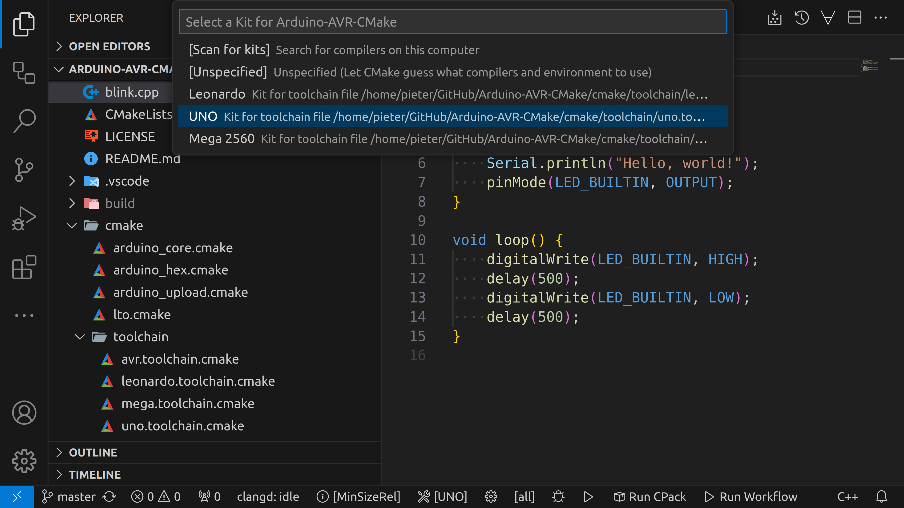

# Arduino AVR CMake

Compile Arduino AVR programs using CMake. 

## Instructions

1. Clone this repository and open a terminal in the `Arduino-AVR-CMake` folder.
2. Ensure that the Arduino AVR core is installed correctly, this guide assumes
   that the core is in `~/.arduino15/packages/arduino/hardware/avr/1.8.3`,
   that the toolchain is in `~/.arduino15/packages/arduino/tools/avr-gcc/7.3.0-atmel3.6.1-arduino7`,
   and that avrdude is in `~/.arduino15/packages/arduino/tools/avrdude/6.3.0-arduino17`.
   If this is not the case, change it now in `cmake/toolchain/avr.toolchain.cmake`.
3. Configure the project using CMake by running the following command:
    ```sh
    cmake -S. -Bbuild \
        -D ARDUINO_PORT=/dev/ttyACM0 \
        -D CMAKE_TOOLCHAIN_FILE=cmake/toolchain/uno.toolchain.cmake \
        -D CMAKE_BUILD_TYPE=MinSizeRel
    ```
    Customize the port, toolchain file, and build type for your specific
    configuration.
4. Finally, build and upload the example “blink” program:
    ```sh
    cmake --build build -j -t upload-blink
    ```
    To compile the program without uploading, you can use 
    ```sh
    cmake --build build -j -t blink
    ```
    If you're using an Arduino with a native USB interface (e.g. Leonardo),
    you'll have to press the reset button before uploading. You could 
    automate this by opening its serial port at 1200 baud as part of the 
    upload process.

## VSCode

In VSCode, you can select the board you want to use using the 
`CMake: Select a Kit` command from the CMake Tools extension, 
or by clicking on the corresponding button at the bottom of the window.
Then select the right board as shown in the following image:


To build the sketch, you can either click the `Build` button at the bottom or 
in the CMake side panel. To upload, you can use the `upload-blink` utility in 
the CMake side panel:

